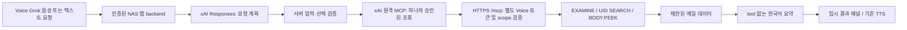

# Voice Grok / Naver Mail MCP 조사와 변경 범위

조사일: 2026-10-08 KST. 클라우드 GitHub checkout의 기존 `work` 브랜치 HEAD에서 `feature/naver-mail-mcp-v1`를 생성했다. worktree나 로컬 데스크톱 파일을 사용하지 않았다.

| 기존 구성 | 조사 결과 | 이번 변경 |
|---|---|---|
| React 19 / TanStack Start / Vite | `reader-app.tsx`, SSE `/api/ask`, `ask-grok.ts` fallback | 네이버 요청만 별도 임시 UI/서버 경로로 분기 |
| 모델 호출 | raw fetch로 xAI `/v1/responses`, `grok-4.5`, `store:false`; SDK 미사용 | 동일 API/모델에 함수 계획 + scoped remote MCP + tool 없는 요약 추가 |
| 기존 도구 | web_search, Google Workspace 별도 함수 계획/확인/실행 | 네이버 read-only 7개를 독립 서비스로 제공; Google writes는 기존 기능 그대로 |
| 음성 | SpeechRecognition/파일 STT, 기존 TTS provider/Google TTS 문장 재생 | 동일 reader/TTS와 active persona voice 사용; Speech-to-Speech/realtime로 재구성하지 않음 |
| Android | 저장소에 별도 Kotlin/Java/AndroidManifest 프로젝트가 없음; 웹/PWA 앱 구조 | 웹앱 흐름의 음성 분기만 구현. 네이티브 APK 빌드/하드웨어 시험은 수행하지 않음 |
| Google OAuth | private NAS backend, PKCE/state, server token storage, Google-specific routes/scopes | OAuth 토큰/scopes/storage 변경 없음; 네이버에 전달하지 않음 |
| 사용자 인증 | NAS private origin/login과 Tailscale Serve identity, loopback listener | 신규 `/api/naver-mail`은 동일 identity + 정확한 Origin 필수. 공개 dev는 기본 403 |
| NAS web | Node 24 Nitro node-server, web-config/google-data, port 8097, Tailscale HTTPS | 기존 startup/Compose 변경 없이 별도 opt-in override 제공 |
| NAS TTS/music | TTS 8092, music 8094, 별도 persistent ledger/worker | 신규 MCP 3001. 파일 선언상 겹치지 않지만 실제 NAS socket 조사 미수행 |
| 백업 | 기존 encrypted recovery, SQLite ledger 및 private runtime 보관 | 새 서비스 복구 항목 문서화; 실제 archive/스케줄/USB/PC 파일 접근 없음 |
| 기억/저장 | threads → local storage/summary/long-term/자동 백업 | 메일 패널/선택은 RAM에만 유지. 메일 원문/요약은 threads에 추가하지 않음 |

메일 데이터 흐름:

Grok 웹은 같은 `/mcp`를 별도 `grok_web` token identity로 사용할 설계이나 인증 UI/프로토콜의 실제 호환성을 입증하기 전에는 차단한다. MCP 서버에 웹 사용자 로그인이나 NAS 관리자 자격증명을 전달하는 구조가 아니다.

변경하지 않은 영역: 기존 `/api/ask`/`ask-grok.ts`, Google OAuth/도구 실행 코드, 페르소나 설정/기억 엔진, TTS 서비스/음악 worker, 실제 NAS/Tailscale/백업. `nas-access.ts`에는 정확한 새 endpoint의 기존 앱 Origin 허용만 추가했다. native 인증 어댑터나 OAuth server를 구현했다는 주장은 하지 않는다.

근거: [xAI remote MCP](https://docs.x.ai/developers/tools/remote-mcp), [Grok connectors](https://docs.x.ai/grok/connectors), [MCP 2026-07-28](https://modelcontextprotocol.io/specification/2026-07-28), [공식 Python SDK](https://github.com/modelcontextprotocol/python-sdk), [네이버 IMAP](https://help.naver.com/service/30029/contents/21344). fetched 문서 및 SDK runtime 지원 버전 조사, 합성 테스트와 실제 서비스 검증을 구분한다.
